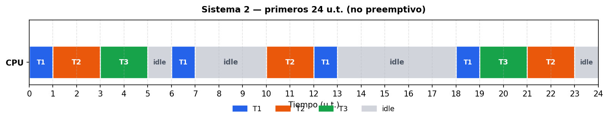
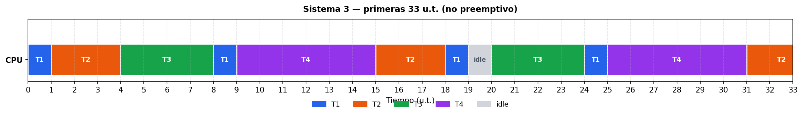

# TP3 – Actividad 01 – Cyclic Scheduling

## Notación

| Símbolo | Significado                                      |
|:--------|:-------------------------------------------------|
| C       | Tiempo máximo de ejecución (WCET)                |
| P       | Período de activación (= T del enunciado)        |
| D       | Plazo de finalización (deadline)                 |
| U       | Factor de carga CPU                              |
| T_M     | Hiperperíodo (ciclo mayor): mcm de todos los P_i |
| T_s     | Ciclo secundario (tamaño de trama)               |
| F       | Cantidad de tramas por hiperperíodo: T_M / T_s   |

En todos los sistemas del enunciado se cumple **P = D**.

### Test de garantía (planificación estática/cíclica)

Para garantizar el cumplimiento de una planificación estática/cíclica (periódica):

| Ecu. | Condición                                        | Significado                                                                      |
|:----:|:-------------------------------------------------|:---------------------------------------------------------------------------------|
| (1)  | T_s >= max(C_i)                                  | Toda **tarea** debe **terminar en un único ciclo secundario**                    |
| (2)  | U = SUM(C_i / P_i) <= 1                          | **Factor de carga CPU**                                                          |
| (3)  | T_M = mcm(P_i)                                   | **Hiperperíodo**                                                                 |
| (4)  | P_i / T_s - floor(P_i / T_s) = 0 (para alguna i) | El **período** de la tarea debe ser **múltiplo entero** del **ciclo secundario** |
| (5)  | 2*T_s - mcd(P_i, T_s) <= D_i (para toda i)       | Cada **tarea** debe terminar antes de un nuevo período de activación             |

**Criterio de planificabilidad:** el sistema es **planificable** si y solo si se cumplen **las cinco ecuaciones**.

### Prioridades

Se asignan de forma estática. Criterio: **deadline monotonic** (menor período (T) implica mayor prioridad).

### Carga de CPU

Carga de cada tarea = **WCET / Period** = **C / T**.

Carga del sistema:

```
U = SUM(Ci / Ti) <= 1   (<= 100%)
```

Si U > 100%, el sistema no es planificable (incumple ecuación **(2)**).

---

## Sistema 1

| Tarea | C | T = D | Prioridad |
|:------|:-:|:-----:|:---------:|
| T1    | 1 |   4   | 1 (mayor) |
| T2    | 2 |   5   |     2     |
| T3    | 5 |  20   | 3 (menor) |

### Carga de CPU

|   Tarea   | Period (T) | WCET (C) |   Carga CPU    |
|:---------:|:----------:|:--------:|:--------------:|
|    T1     |     4      |    1     | 1/4 = **25%**  |
|    T2     |     5      |    2     | 2/5 = **40%**  |
|    T3     |     20     |    5     | 5/20 = **25%** |
| **Total** |            |          |  **U = 90%**   |

Condición necesaria: **U <= 100%** cumple.

### Hiperperíodo (ecuación 3)

```
T_M = mcm(4, 5, 20) = 20
```

### Ciclo secundario T_s (ecuaciones 1, 4 y 5)

Candidatos con T_s >= max (C_i) = 5 (ec. 1): T_s puede ser 5, 10 o 20.

| T_s | F = T_M/T_s | Ecu. (4) |  Ecu. (5) — peor caso T1  | Válida |
|:---:|:-----------:|:--------:|:-------------------------:|:------:|
|  5  |      4      |    Sí    |  2*5 - mcd(4,5) = 9 > 4   |   No   |
| 10  |      2      |    Sí    | 2*10 - mcd(4,10) = 18 > 4 |   No   |
| 20  |      1      |    Sí    | 2*20 - mcd(4,20) = 36 > 4 |   No   |

**Resultado:** no existe T_s válido → incumple ecuaciones **(1), (4) y (5)**.

### Test de garantía

| Ecuación                         | Resultado                                           |
|:---------------------------------|:----------------------------------------------------|
| (1) T_s >= max(C_i)              | Candidatos probados (5, 10, 20), ninguno cumple (5) |
| (2) U <= 1                       | 90% <= 100% → cumple                                |
| (3) T_M = mcm(P_i)               | 20 u.t.                                             |
| (4) P_i / T_s entero             | Se cumple para los candidatos, pero no alcanza      |
| (5) 2·T_s - mcd(P_i, T_s) <= D_i | Falla para T1 en todos los candidatos               |
| **Planificable**                 | **No** (no se cumplen las 5 ecuaciones)             |

---

## Sistema 2

| Tarea | C | T = D | Prioridad |
|:------|:-:|:-----:|:---------:|
| T1    | 1 |   6   | 1 (mayor) |
| T2    | 2 |  10   |     2     |
| T3    | 2 |  18   | 3 (menor) |

### Carga de CPU

|   Tarea   | Period (T) | WCET (C) |    Carga CPU     |
|:---------:|:----------:|:--------:|:----------------:|
|    T1     |     6      |    1     | 1/6 = **16,7%**  |
|    T2     |     10     |    2     |  2/10 = **20%**  |
|    T3     |     18     |    2     | 2/18 = **11,1%** |
| **Total** |            |          |  **U = 47,8%**   |

Condición necesaria: **U <= 100%** → cumple.

### Hiperperíodo (ecuación 3)

```
T_M = mcm(6, 10, 18) = 90
```

### Ciclo secundario T_s (ecuaciones 1, 4 y 5)

Con T_s >= max (C_i) = 2 (ec. 1), candidatos que cumplen (4) y (5):

| T_s | F = T_M/T_s | Ecu. (4) | Ecu. (5) | Válida |
|:---:|:-----------:|:--------:|:--------:|:------:|
|  2  |     45      |    Sí    |    Sí    |   Sí   |
|  3  |     30      |    Sí    |    Sí    |   Sí   |
|  6  |     15      |    Sí    |    Sí    |   Sí   |

Se elige **T_s = 2** (trama mínima válida).

### Test de garantía

| Ecuación                         | Resultado                         |
|:---------------------------------|:----------------------------------|
| (1) T_s >= max(C_i)              | max(C_i) = 2; T_s = 2 cumple      |
| (2) U <= 1                       | 47,8% <= 100% → cumple            |
| (3) T_M = mcm(P_i)               | 90 u.t.                           |
| (4) P_i / T_s entero             | Cumple (p. ej. P_1/T_s = 6/2 = 3) |
| (5) 2·T_s - mcd(P_i, T_s) <= D_i | Cumple para T_s = 2               |
| **Planificable**                 | **Sí** (cumple las 5 ecuaciones)  |

### Diagrama de Gantt



| Desde | Hasta | Tarea |
|:-----:|:-----:|:-----:|
|   0   |   1   |  T1   |
|   1   |   3   |  T2   |
|   3   |   5   |  T3   |
|   5   |   6   | idle  |
|   6   |   7   |  T1   |
|   7   |  10   | idle  |
|  10   |  12   |  T2   |
|  12   |  13   |  T1   |
|  13   |  18   | idle  |
|  18   |  19   |  T1   |
|  19   |  20   |  T3   |
|  20   |  22   |  T2   |
|  22   |  23   |  T3   |
|  23   |  24   | idle  |

---

## Sistema 3

| Tarea | C | T = D | Prioridad |
|:------|:-:|:-----:|:---------:|
| T1    | 1 |   8   | 1 (mayor) |
| T2    | 3 |  15   |     2     |
| T3    | 4 |  20   |     3     |
| T4    | 6 |  22   | 4 (menor) |

### Carga de CPU

|   Tarea   | Period (T) | WCET (C) |    Carga CPU     |
|:---------:|:----------:|:--------:|:----------------:|
|    T1     |     8      |    1     | 1/8 = **12,5%**  |
|    T2     |     15     |    3     |  3/15 = **20%**  |
|    T3     |     20     |    4     |  4/20 = **20%**  |
|    T4     |     22     |    6     | 6/22 = **27,3%** |
| **Total** |            |          |  **U = 79,8%**   |

Condición necesaria: **U <= 100%** → cumple.

### Hiperperíodo (ecuación 3)

```
T_M = mcm(8, 15, 20, 22) = 1320
```

### Ciclo secundario T_s (ecuaciones 1, 4 y 5)

Con T_s >= max (C_i) = 6 (ec. 1):

| T_s | F = T_M/T_s | Ecu. (4) | Ecu. (5) | Válida |
|:---:|:-----------:|:--------:|:--------:|:------:|
|  8  |     165     |    Sí    |    Sí    |   Sí   |
| 10  |     132     |    Sí    |    No    |   No   |
| 11  |     120     |    Sí    |    No    |   No   |
| 15  |     88      |    Sí    |    No    |   No   |
| 20  |     66      |    Sí    |    No    |   No   |
| 22  |     60      |    Sí    |    No    |   No   |

**Resultado:** T_s = 8, F = 165 tramas.

### Test de garantía

| Ecuación                         | Resultado                         |
|:---------------------------------|:----------------------------------|
| (1) T_s >= max(C_i)              | max(C_i) = 6; T_s = 8 cumple      |
| (2) U <= 1                       | 79,8% <= 100% → cumple            |
| (3) T_M = mcm(P_i)               | 1320 u.t.                         |
| (4) P_i / T_s entero             | Cumple (p. ej. P_1/T_s = 8/8 = 1) |
| (5) 2·T_s - mcd(P_i, T_s) <= D_i | Cumple para T_s = 8               |
| **Planificable**                 | **Sí** (cumple las 5 ecuaciones)  |

### Diagrama de Gantt



| Desde | Hasta | Tarea |
|:-----:|:-----:|:-----:|
|   0   |   1   |  T1   |
|   1   |   4   |  T2   |
|   4   |   8   |  T3   |
|   8   |   9   |  T1   |
|   9   |  15   |  T4   |
|  15   |  16   |  T2   |
|  16   |  17   |  T1   |
|  17   |  19   |  T2   |
|  19   |  20   | idle  |
|  20   |  24   |  T3   |
|  24   |  25   |  T1   |
|  25   |  31   |  T4   |
|  31   |  32   |  T2   |
|  32   |  33   |  T1   |

---

## Sistema 4

| Tarea |  C  | T = D | Prioridad |
|:------|:---:|:-----:|:---------:|
| T1    | 0.5 |   4   | 1 (mayor) |
| T2    |  1  |   5   |     2     |
| T3    |  2  |  10   |     3     |
| T4    |  9  |  24   | 4 (menor) |

### Carga de CPU

|   Tarea   | Period (T) | WCET (C) |     Carga CPU     |
|:---------:|:----------:|:--------:|:-----------------:|
|    T1     |     4      |   0,5    | 0,5/4 = **12,5%** |
|    T2     |     5      |    1     |   1/5 = **20%**   |
|    T3     |     10     |    2     |  2/10 = **20%**   |
|    T4     |     24     |    9     | 9/24 = **37,5%**  |
| **Total** |            |          |    **U = 90%**    |

Condición necesaria: **U <= 100%** → cumple.

### Hiperperíodo

```
T_M = mcm(4, 5, 10, 24) = 120
```

### Ciclo secundario T_s (ecuaciones 1, 4 y 5)

Candidatos con T_s >= max (C_i) = 9 (ec. 1): T_s puede ser 10, 12 o 24.

| T_s | F = T_M/T_s | Ecu. (4) |  Ecu. (5) — peor caso T1  | Válida |
|:---:|:-----------:|:--------:|:-------------------------:|:------:|
| 10  |     12      |    Sí    | 2*10 - mcd(4,10) = 18 > 4 |   No   |
| 12  |     10      |    Sí    | 2*12 - mcd(4,12) = 20 > 4 |   No   |
| 24  |      5      |    Sí    | 2*24 - mcd(4,24) = 44 > 4 |   No   |

**Resultado:** no existe T_s válido → incumple ecuaciones **(1), (4) y (5)**.

### Test de garantía

| Ecuación                         | Resultado                                            |
|:---------------------------------|:-----------------------------------------------------|
| (1) T_s >= max(C_i)              | Candidatos probados (10, 12, 24), ninguno cumple (5) |
| (2) U <= 1                       | 90% <= 100% → cumple                                 |
| (3) T_M = mcm(P_i)               | 120 u.t.                                             |
| (4) P_i / T_s entero             | Se cumple para los candidatos, pero no alcanza       |
| (5) 2·T_s - mcd(P_i, T_s) <= D_i | Falla para T1 en todos los candidatos                |
| **Planificable**                 | **No** (no se cumplen las 5 ecuaciones)              |

---

## Resumen

| Sistema | U (ec. 2) | T_M (ec. 3) | T_s |  F  | Test (1)–(5) | Planificable |
|:--------|:---------:|:-----------:|:---:|:---:|:------------:|:------------:|
| 1       |    90%    |     20      |  —  |  —  |      No      |    **No**    |
| 2       |   47,8%   |     90      |  2  | 45  |      Sí      |    **Sí**    |
| 3       |   79,8%   |    1320     |  8  | 165 |      Sí      |    **Sí**    |
| 4       |    90%    |     120     |  —  |  —  |      No      |    **No**    |

---

## Configuración FreeRTOS (Paso 03)

PENDIENTE